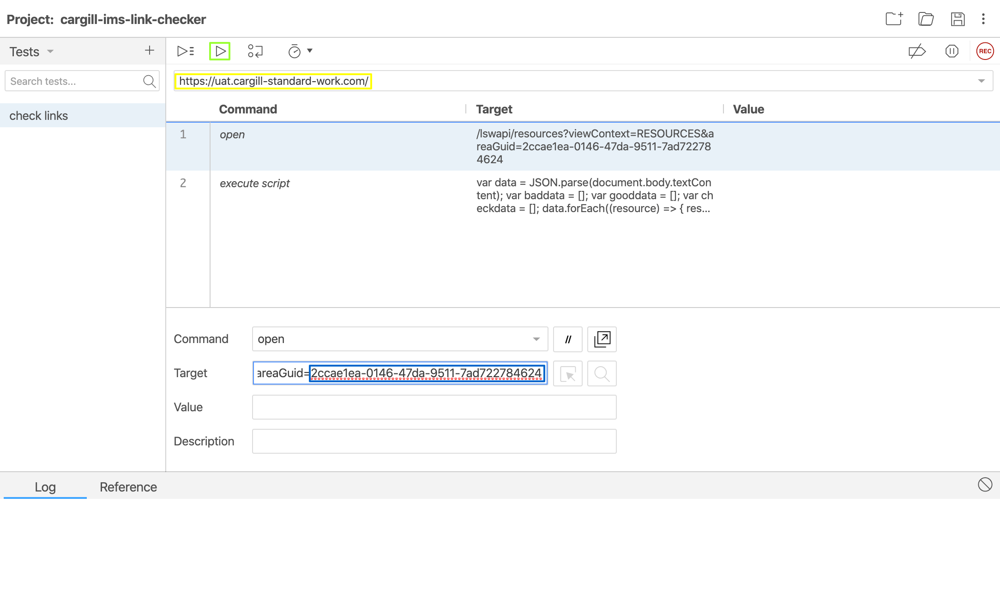

# 3b-link-checker

## Notes
This has only been tested and confirmed working for Chrome

## Installation

 1. save the `cargill-ims-link-checker.side` file to a location on your computer
 2. Install the Selenium IDE extension for chrome ([link](https://chrome.google.com/webstore/detail/selenium-ide/mooikfkahbdckldjjndioackbalphokd?hl=en))

## Usage
 1. Open Chrome
 2. Go to the IMS application and log in (if you are not logged in prior to running the link checker, it will not work)
 3. Open Selenium IDE
 4. In the pop up window that should appear, select the option for `Open an existing project`
 5. In the open file dialog box, find the `cargill-ims-link-checker.side` file that you downloaded in step 1
 6. Selenium IDE should now look something like this: 
 7. Change the base URL if necessary (circled in yellow)
 8. Change the Area ID if necessary (circled in blue - See **Debug** section for more information)
 9. Click on the Run button (circled in green) to run the link checker
 10. Give it a moment and eventually a file should be downloaded to your computer.  You may wish to rename the file and give it a `.csv` extension so you can easily open it with Excel. 

## CSV File
The CSV file has the following columns:
 1. **Status** - will be in the format of `<GOOD|ERROR>: 
`.  Working links are prefixed with GOOD and include the HTTP status code that was returned (should be 200).  Broken links are prefixed with ERROR and include an error code.
 2. **Resource Name** - This is the name of the resource in IMS.
 3. **Owner** - This is the resource contact.
 4. **Created At** - This is the timestamp of when the resource was created.
 5. **Last Modified** - This is the timestamp of when the resource was last updated.
 6. **Resource Link** - This is the link that is attached to the resource and is what the link checker verifies.
 7. **Link** - This is the deep link to the resource within IMS itself.

## Common Errors
 - **empty link** - There was no link attached to the resource.
 - **TypeError: Failed to fetch** - was not able to connect to the resource.  See **Failed to Fetch** section for more details.
 - **400** - Bad request.  Double check the link.  Most of the time, this isn't actually an error, especially any video at web.microsoftstream.com.
 - **404** - Link not found.

## Failed to Fetch
The most common cause for this is that DNS can not be resolved.  This can happen if you're not on the VPN and internal Cargill domains can not be resolved.

Also, there are false positives here as well.  For some reason sites like google.com show up with this error.

## Debug
If for whatever reason you get an error with running the link checker, the best way to debug is to open the web developer tools in the window that Selenium IDE opens ([https://developers.google.com/web/tools/chrome-devtools/open](https://developers.google.com/web/tools/chrome-devtools/open)). Use the `console` to see if there are any javascript errors. 

Use the `network` tab to double check the Area ID.  With the network tab open, go to the IMS app and click on the Resources link to load all the resources.  In the `network` tab, you should see a line that that starts with:
`resources?viewContext=RESOURCES&areaGuid=...`

The Area ID is the value after the `areaGuid=`.  Edit this value in the Selenium IDE project if necessary.

## Caveats
Resource Links with a `#` in them break the script so they have been URLEncoded with %23
